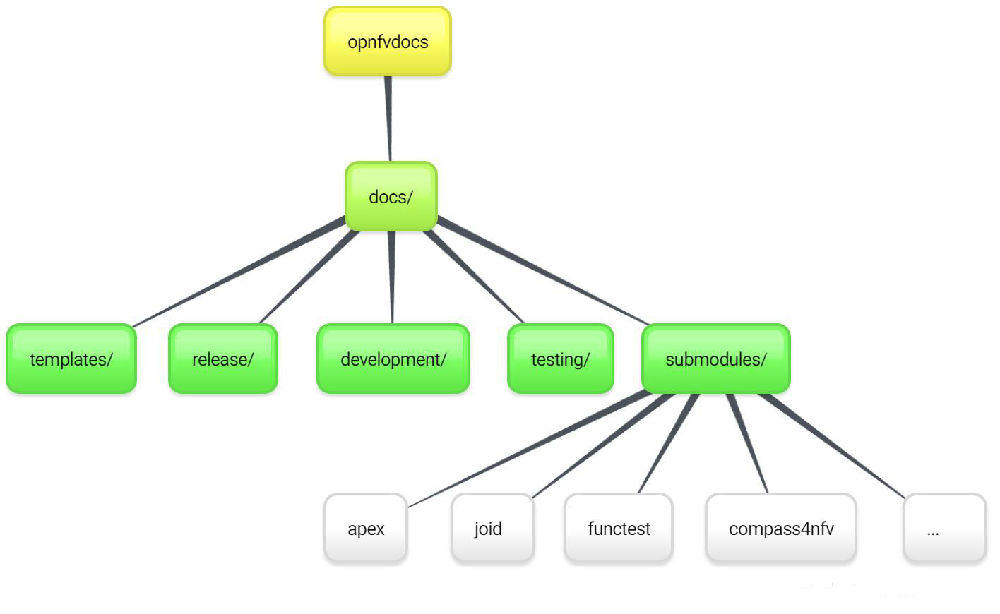

.. _include-documentation:
============================
Including your Documentation
============================

.. contents::
   :depth: 3
   :local:

In your project repository
--------------------------

Add your documentation to your repository in the folder structure and
according to the templates listed above. The documentation templates you
will require are available in opnfvdocs/docs/templates/ repository, you should
copy the relevant templates to your <repo>/docs/ directory in your repository.
For instance if you want to document userguide, then your steps shall be
as follows:

.. code-block:: bash

   git clone ssh://<your_id>@gerrit.opnfv.org:29418/opnfvdocs.git
   cp -p opnfvdocs/docs/userguide/* <my_repo>/docs/userguide/

You should then add the relevant information to the template that will
explain the documentation. When you are done writing, you can commit
the documentation to the project repository.

.. code-block:: bash

   git add .
   git commit --signoff --all
   git review

In OPNFVDocs Composite Documentation
------------------------------------

In toctree
+++++++++++

To import project documents from project repositories, we use submodules.
 Each project is stored in :code:`opnfvdocs/docs/submodule/` as follows:

To include your project specific documentation in the composite documentation,
first identify where your project documentation should be included.
Say your project userguide should figure in the ‘OPNFV Userguide’, then:

.. code-block:: bash

   vim opnfvdocs/docs/release/userguide.introduction.rst

This opens the text editor. Identify where you want to add the userguide.
If the userguide is to be added to the toctree, simply include the path to
it, example:

.. code-block:: bash

   .. toctree::
       :maxdepth: 1

    submodules/functest/docs/userguide/index
    submodules/bottlenecks/docs/userguide/index
    submodules/yardstick/docs/userguide/index
    <submodules/path-to-your-file>

As Hyperlink
++++++++++++

It's pretty common to want to reference another location in the
OPNFV documentation and it's pretty easy to do with
reStructuredText. This is a quick primer, more information is in the
`Sphinx section on Cross-referencing arbitrary locations
<http://www.sphinx-doc.org/en/stable/markup/inline.html#ref-role>`_.

Within a single document, you can reference another section simply by::

   This is a reference to `The title of a section`_

Assuming that somewhere else in the same file there a is a section
title something like::

   The title of a section
   ^^^^^^^^^^^^^^^^^^^^^^

It's typically better to use ``:ref:`` syntax and labels to provide
links as they work across files and are resilient to sections being
renamed. First, you need to create a label something like::

   .. _a-label:

   The title of a section
   ^^^^^^^^^^^^^^^^^^^^^^

.. note:: The underscore (_) before the label is required.

Then you can reference the section anywhere by simply doing::

    This is a reference to :ref:`a-label`

or::

    This is a reference to :ref:`a section I really liked <a-label>`

.. note:: When using ``:ref:``-style links, you don't need a trailing
          underscore (_).

Because the labels have to be unique, it usually makes sense to prefix
the labels with the project name to help share the label space, e.g.,
``sfc-user-guide`` instead of just ``user-guide``.

Once you have made these changes you need to push the patch back to
the opnfvdocs team for review and integration.

.. code-block:: bash

   git add .
   git commit --signoff --all
   git review

Be sure to add the project leader of the opnfvdocs project
as a reviewer of the change you just pushed in gerrit.

'doc8' Validation
-----------------
It is recommended that all rst content is validated by `doc8 <https://pypi.python.org/pypi/doc8>`_ standards.
To validate your rst files using doc8, install doc8.

.. code-block:: bash

   sudo pip install doc8

doc8 can now be used to check the rst files. Execute as,

.. code-block:: bash

   doc8 --ignore D000,D001 <file>

Testing: Build Documentation Locally
------------------------------------

Composite OPNFVDOCS documentation
+++++++++++++++++++++++++++++++++
To build whole documentation under opnfvdocs/, follow these steps:

Install virtual environment.

.. code-block:: bash

   sudo pip install virtualenv
   cd /local/repo/path/to/project

Download the OPNFVDOCS repository.

.. code-block:: bash

   git clone https://gerrit.opnfv.org/gerrit/opnfvdocs

Change directory to opnfvdocs & install requirements.

.. code-block:: bash

   cd opnfvdocs
   sudo pip install -r etc/requirements.txt

Update submodules, build documentation using tox & then open using any browser.

.. code-block:: bash

   cd opnfvdocs
   git submodule update --init
   tox -edocs
   firefox docs/_build/html/index.html

.. note:: Make sure to run `tox -edocs` and not just `tox`.

Individual project documentation
++++++++++++++++++++++++++++++++
To test how the documentation renders in HTML, follow these steps:

Install virtual environment.

.. code-block:: bash

   sudo pip install virtualenv
   cd /local/repo/path/to/project

Download the opnfvdocs repository.

.. code-block:: bash

   git clone https://gerrit.opnfv.org/gerrit/opnfvdocs

Change directory to opnfvdocs & install requirements.

.. code-block:: bash

   cd opnfvdocs
   sudo pip install -r etc/requirements.txt

Move the conf.py file to your project folder where RST files have been kept:

.. code-block:: bash

   mv opnfvdocs/docs/conf.py <path-to-your-folder>/

Move the static files to your project folder:

.. code-block:: bash

   mv opnfvdocs/_static/ <path-to-your-folder>/

Build the documentation from within your project folder:

.. code-block:: bash

   sphinx-build -b html <path-to-your-folder> <path-to-output-folder>

Your documentation shall be built as HTML inside the
specified output folder directory.

.. note:: Be sure to remove the `conf.py`, the static/ files and the output folder from the `<project>/docs/`. This is for testing only. Only commit the rst files and related content.

Adding your project repository as a submodule
--------------------------

Clone the opnfvdocs repository and your submodule to .gitmodules following the convention of the file

.. code-block:: bash

  cd docs/submodules/
  git submodule add https://gerrit.opnfv.org/gerrit/$reponame
  git submodule init $reponame/
  git submodule update $reponame/
  git add .
  git review
