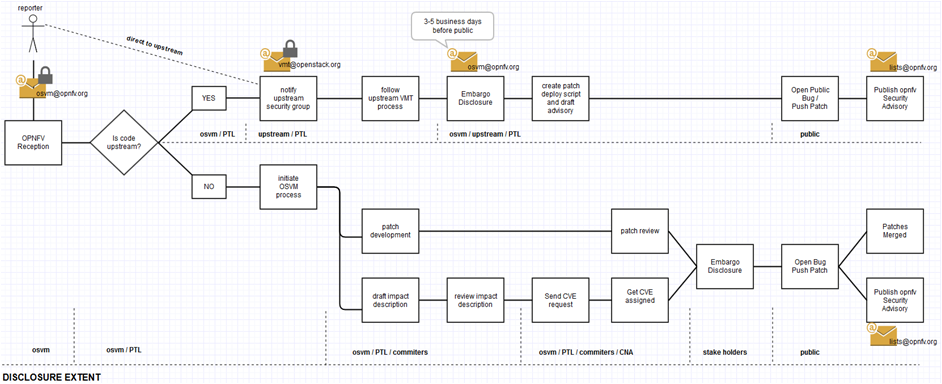

=======================================
OPNFV Security Vulnerability Management
=======================================

The OSVM process is the manage and coordinate the progressive disclosure and management of vulnerabilities reported or discovered within the opnfv-eco system and upstream projects.

The process inherits from the already present and well functioning OSSG VMT Process and follows the Responsible Disclosure Approach.

The opnfv osvm process is licensed under CC Attribution 3.0 Unported and was kindly granted use to us by the OpenStack vulnerability Management Team. New additions / refinements made by the opnfv security group are also under the 3.0 Unported license.
