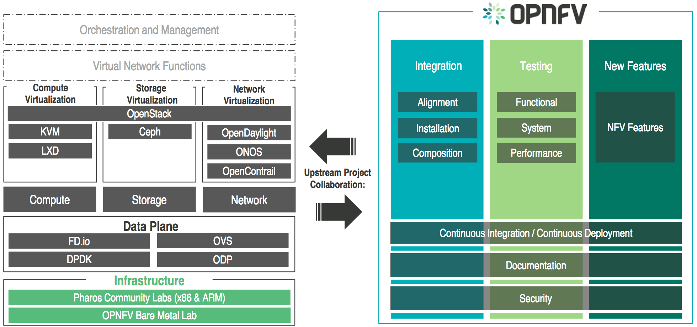

.. This work is licensed under a Creative Commons Attribution 4.0 International License.
.. http://creativecommons.org/licenses/by/4.0
.. (c) Open Platform for NFV Project, Inc. and its contributors

********************************
OPNFV Platform Overview Document
********************************

.. toctree::
   :maxdepth: 2

============
Introduction
============

OPNFV is a carrier-grade, integrated, open source platform to accelerate the introduction
of new NFV products and services. As an open source project, OPNFV strives
to bring together the work of standards bodies, open source communities and commercial
suppliers to deliver a de facto standard open source NFV platform for the industry.

By integrating components from upstream projects, the community is able to perform performance
and use case-based testing on a variety of solutions to ensure the platform’s suitability for
NFV use cases. OPNFV also works upstream with other open source communities to bring both contributions
and learnings from its work directly to those communities in the form of blueprints, patches,
and new code.

OPNFV initially focused on building NFV Infrastructure (NFVI) and Virtualized Infrastructure
Management (VIM) by integrating components from upstream projects such as OpenDaylight,
OpenStack, Ceph Storage, KVM, Open vSwitch, and Linux.
More recetly OPNFV has extended it's portfolio of forwarding soluitons to include fd.io and ODP,
is able to run on both Intel and ARM commercial & white-box hardwares, and includes
MANO components primarily for application composition and management in the Colorado release.

These capabilities, along with application programmable interfaces (APIs) to other NFV
elements, form the basic infrastructure required for Virtualized Network Functions (VNF)
and Management and Network Orchestration (MANO) components.

Concentrating on these components while also considering proposed projects on additional
topics (such as the MANO components and applciations themselves), OPNFV aims to enhance
NFV services by increasing performance and power efficiency, improving reliability,
availability and serviceability, and delivering comprehensive platform instrumentation.

===========================
OPNFV platform architecture
===========================

The OPNFV project addresses a number of aspects in the development of a consistent virtualization
platform including common hardware requirements, software architecture, management & orchestration
and applications.

To address these areas effectively the platform architecture as the OPNFV project approaches it
can be decomposed into the basic building blocks:

* Hardware: with the Infra working group, Pharos project and associated activites
* Software Platform: through the platform integration and deployment projects
* Management and Orchestration: through the MANO WG and associated projects
* Applications: which affect all other areas and drive requirements for OPNFV

OPNFV lab infrastructure
========================

The infrastructure working group oversees such topics as lab management, workflow,
definitions, metrics and tools for OPNFV infrastructure.

Fundamental to the WG is the `Pharos Project <https://www.opnfv.org/developers/pharos>`_
which provides a set of defined lab infrastructures over a geographically and technically
diverse federated global OPNFV lab.

Labs may instantiate bare-metal and virtual environments that are accessed remotely by the
community and used for OPNFV platform and feature development, build, deploy and testing.
No two labs are the same and the hetrogeniety of the Pharos environment provides the ideal
platform for establishing hardware and software abstractions providing well understood
performance characteristics.

Community labs are hosted by OPNFV member companies on a voluntary basis.
The Linux Foundation also hosts an OPNFV lab that provides centralised CI
and other production resources which are linked to community labs.
Future lab capabilities will include the ability easily automate deploy and test of any
OPNFV install scenario in any lab environemnt as well as on a nested "Lab as a service"
virtual infrastructure.

OPNFV software platform architecture
====================================

The OPNFV software platform is comprised exclusively of open source implementations of
platform component pieces.  OPNFV is able to draw from the rich ecosystem of NFV related
technologies available in open source then integrate, test, measure and improve these
components in conjunction with our source communitites.

While the composition of the OPNFV software platform is highly complex and constituted of many
projects and components, a subset of these projects gain the most atention from the OPNFV community
to drive the development of new technologies and capabilities.

--------------------------------
Virtual infrastrcture management
--------------------------------

OPNFV derives it's virtual infrastructure management form one of our largest upsteram ecosystems,
OpenStack.  OpenStack provides a complete reference cloud management system and associated technologies.
While the OpenStack community sustains a broad set of projects not all technologies are relevant in
an NFV domain, the OPNFV community consumes a sub-set of openstack projects where the usage and
composition may vary depending on the installer and scenario.

For details on the scenario's available in OPNFV and the specific composition of components
refer to the OPNFV installation instruction:
https://artifacts.opnfv.org/colorado/opnfvdocs/installationprocedure/index.rst

-----------------
Operating systems
-----------------

OPNFV currently uses Linux on all target machines, this can include Ubuntu, Ceph or SuSe linux. The
specific version of Linux used for any deployment will be documented in the installation guide.

-----------------------
Networking technologies
-----------------------

SDN Controllers
---------------

OPNFV, as an NFV focused project, has a significant investment on networking technologies
and provides a broad variety of integrated open source reference solutions.  The diversity
of controllers able to be used in OPNFV is supported by a simillarly diverse set of
forwarding technologies.

There are many SDN controllers available today relevan to virtual environments
where the OPNFV community supports and contributes to a number of these.  The controllers
being worked on by the community during this release of OPNFV include:

* Neutron - is an OpenStack project to provide “network connectivity as a service” between
  interface devices (e.g., vNICs) managed by other OpenStack services (e.g., nova).
* OpenDaylight - addresses multivendor, traditional and greenfield networks, establishing the
  industry’s de facto SDN platform and providing the foundation for networks of the future.
* ONOS - is a carrier-grade SDN network operating system designed for high availability,
  performance, scale-out.

.. OpenContrail SDN controller is planned to be supported in the next release.

Data Plane
----------

OPNFV extends the Linux virtual networking capabilies by using virtual switching
and routing components, the OPNFV community proactively engages with these source
communities to address performance, scale and resiliency needs apparent in carrier
networks.

* FD.io - (Fast data - Input/Output) is a collection of several projects and libraries to
  amplify the transformation that began with Data Plane Development Kit (DPDK) to support
  flexible, programmable and composable services on a generic hardware platform.
* Open vSwitch - is a production quality, multilayer virtual switch designed to enable
  massive network automation through programmatic extension, while still supporting standard
  management interfaces and protocols.

Deployment Architecture
=======================

A typical OPNFV deployment starts with 3 controller nodes running in a high availability
configuration including control plane components from OpenStack, SDN, etc. and a minimum
of 2 compute nodes for deployment of workloads (VNFs).
A detailed description of the hardware requirements required to support the 5 node configuration
can be found in pharos specification: https://artifacts.opnfv.org/pharos/docs/specification/index.rst

In addition to the deployment on a highly available physical infrastructure OPNFV can be
deployed, for development and lab purposes, in a virtual environment.  In this case each of the hosts
is provided by a virtual machine and allows control and workload placement using nested virtualization.

The initial deployment is done using a staging server, in OPNFV referred to as the "jumphost".
This server, either physical or virtual, is first installed with the installation program
that then installs OpenStack and other components on the controller nodes and compute nodes.
See the `OPNFV User Guide`_ for more details.

===========================
The OPNFV Testing ecosystem
===========================

The OPNFV community has set out to address the needs of virtualisation in the carrier
network and as such platform validation and measurements are a cornerstone to our
iterative releases and objectives.

To simplify the complex task of feature, component and platform validation and characterisation
our testing community have established a fully automated method for addressing all key areas
of platform validation.  This has required the integration of a variety of testing frameworks
in our CI systems, real time and automated analysis of results, storage and publication of key
facts for each run.

Release verification
====================

The OPNFV community relies on it's testing community to establish our release criteria for
each OPNFV release.  Each release cycle the testing criteria becomes more stringent and
better representative of our feature and resiliency requirements.

As each OPNFV release establishes a set of deployment scenarios to validate, our testing
infrastructure and test suites need to be able to accomodate these features and capabilities.
It is not only in the validation of the scenarios themselves that complexity increases,
there are test cases that require mutiple datacenters to execute when evaluating features
including multisite and distributed datacenter solutions.

The release criteria as established by the testing teams includes passing a set of
test cases derived from our functional testing project 'functest', a set of test cases derived
from our platform system and performance test project 'yardstick', and a selection of test
cases for feature capabilities derived from other test projects such as bottlenecks,
vsperf, cperf and storperf.  The scenario needs to be able to be deployed, pass these tests
and be removed from the infrastructure iterarively (no less that 4 times) in order to
fulfill the release criteria.

--------
Functest
--------

Functest provides a functional testing framework along with a set of test suites
and test cases that test and verify OPNFV platform functionality.
The scope of Functest and relevant test cases can be found in its
`user guide <http://artifacts.opnfv.org/functest/brahmaputra/docs/userguide/userguide.pdf>`_.

In Brahmaputra, Functest is focusing on OpenStack and SDN controllers deployment testing.
Its testing framework combines a number of testing tools
to verify the key components of the OPNFV platform are running successfully.
For example, Rally and Tempest are integrated for OpenStack basic functional testing and benchmark,
Robot is used for ODL testing, and Teston is integrated for ONOS testing.
Besides these, Functest also includes tests by deploying candidate VNFs such as vPing and vIMS, and testing their basic functionality.

---------
Yardstick
---------

Yardstick is a testing project for verifying the infrastructure compliance when running VNF applications.
Yardstick can benchmark a number of characteristics/performance vectors about the infrastructure,
that makes it become a useful pre-deployment NFVI testing tools.

Yardstick is also a flexible testing framework supporting OPNFV feature testing by the various projects in OPNFV.
Projects can plug in their test cases for specific features easily.

The detail of Yardstick project can be found in the
`yardstick user guide <http://artifacts.opnfv.org/yardstick/brahmaputra/user_guides_framework/user_guides_framework.pdf>`_.

There are two types of test cases in Yardstick: Yardstick generic test cases and OPNFV feature test cases.
Yardstick generic test cases include basic characteristics benchmarking in compute/storage/network area.
OPNFV feature test cases include basic telecom feature testing from OPNFV projects,
for example nfv-kvm, sfc, ipv6, Parser, Availability and SDN VPN.

All of the Yardstick test cases are listed on
`<http://artifacts.opnfv.org/yardstick/brahmaputra/docs/configguide_yardstick_testcases/03-list-of-tcs.html>`_.

System evaluation and compliance testing
========================================

The OPNFV community is developing a set of test suites intended to evaluate a set of reference behaviours
and capabilities for NFV systems developed externally from the OPNFV ecosystem to evaluate and measure
their ability to provide the features and capabilities developed in the OPNFV eco-system.

The `Dovetail project`_ will provide a testing harness able to be used on any NFV platrofm, including an agreed
set of test cases establising an evaluation cirtesria for exercisiing an OPNFV compatible system.  The Dovetail
project has begun establishing the test framework and will provide a preliminary hardness for the Colorado
release.  Work will continue to develop the test cases and harness to establish a stand along compliance
evaluation solution in future releases.

Additional Testing
==================

Besides the test suites and cases for release verification, additional testing is performed to validate
specific features or characteristics of the OPNFV platform.
These testing framework and test cases may include some specific needs; such as extended measurements,
additional testing stimuli, or tests simulating environmental disturbances or failures.

These additional testing activities provide a more complete evaluation of the OPNFV platform.
Some of the projects focused on these testing areas include:

----
Qtip
----

Qtip is a performance benchmark testing project by using a "Bottom-Up" approach for characterizing
and benchmarking OPNFV platform.

------
VSPERF
------

VSPERF provides a generic and architecture agnostic vSwitch testing framework and associated tests,
this serves as a basis for validating the suitability of different vSwitch implementations and deployments.

-----------
Bottlenecks
-----------

Bottlenecks provides a framework to find system limitations and bottlenecks, providing
root cause isolation capabilities to facilitate system evaluation.

.. _`OPNFV Configuration Guide`: http://artifacts.opnfv.org/opnfvdocs/brahmaputra/docs/configguide
.. _`OPNFV User Guide`: http://artifacts.opnfv.org/opnfvdocs/brahmaputra/docs/userguide

