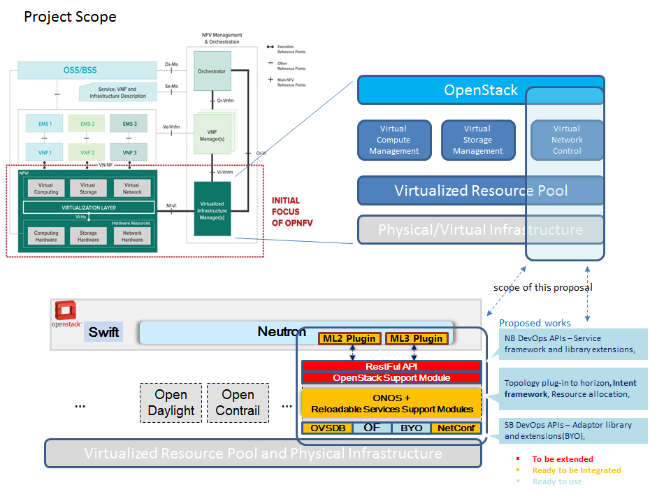

.. This work is licensed under a Creative Commons Attribution 4.0 International License.
.. http://creativecommons.org/licenses/by/4.0
.. (c) OPNFV, Huawei

========================
Target software platform
========================

Software architecture
=====================

This section will provide information which upstream projects, versions and components are
integrated in the Brahmaputra release

OpenStack
---------

OPNFV uses OpenStack as cloud management system.
Brahmaputra is based on OpenStack Liberty Release. It comprises the following sub-projects
and modules:

* Nova (Compute)
* Neutron (Network)
* Cinder (Block Storage)
* Swift (Object Storage)
* Ceilometer (Telemetry)
* Keystone (Identity)
* Glance (Image Service)
* Heat (Orchestration)
* etc.

Some of the sub-projects are not deployed in all scenarios.
Besides target software, also deployment and test framework use OpenStack components
(Fuel, Tempest, Rally)

Operating System
----------------

OPNFV uses Linux on all target machines. Depending on the installers, different
distributions are supported.

Ubuntu 14 supported by Fuel, Compass and Joid installers
CentOS 7 supported by Apex and Compass

SDN Controllers
---------------

OPNFV Brahmaputra release supports three different SDN controllers:

* OpenDaylight (ODL, Beryllium release)
* ONOS (Emu release)
* OpenContrail (?)

Depending on the SDN controller you are using, the featureset will vary.
Brahmaputra also provides scenarios without an SDN controller, just using OpenStack Neutron.

OpenDaylight
++++++++++++

Editor's note:
We need a high level paragraph here and a description of how we use ODL.

ONOS
++++

.. ONOS intro taken from https://wiki.onosproject.org/pages/viewpage.action?pageId=2851517

ONOS stands for **O** pen **N** etwork **O** perating **S** ystem. ONOS provides the control plane
for a software-defined network (SDN), managing network components, such as switches and links,
and running software programs or modules to provide communication services to end hosts and
neighboring networks.

* If you are familiar with server operating systems, you will find that ONOS provides some
  analogous types of functionality, including APIs and abstractions, resource allocation, and
  permissions, as well as user-facing software such as a CLI, a GUI, and system applications.

* If you are familiar with traditional "inside the box" switch operating systems, you will find
  that ONOS manages your entire network rather than a single device, which can dramatically
  simplify management, configuration, and deployment of new software, hardware and services.

* If you are familiar with SDN controllers, you should feel right at home because the ONOS
  platform and applications act as an extensible, modular, distributed SDN controller.

The most important benefit of an operating system is that it provides a useful and usable
platform for software programs designed for a particular application or use case. ONOS
applications and use cases often consist of customized communication routing, management, or
monitoring services for software-defined networks. Some examples of things which you can do with
ONOS, and software written to run on ONOS, may be found in Applications and Use Cases.

ONOS can run as a distributed system across multiple servers, allowing it to use the CPU and
memory resources of multiple servers while providing fault tolerance in the face of server
failure and potentially supporting live/rolling upgrades of hardware and software without
interrupting network traffic.

The ONOS kernel and core services, as well as ONOS applications, are written in Java as bundles
that are loaded into the Karaf OSGi container. OSGi is a component system for Java that allows
modules to be installed and run dynamically in a single JVM. Since ONOS runs in the JVM, it can
run on several underlying OS platforms such as Ubuntu or OS X.

More information on the internal design of ONOS may be found in Architecture Guide, and
information on developing ONOS applications may be found in the Developer's Guide.

ONOS is an open source project backed by an expanding community of developers and users, and you
are invited and encouraged to join in discussion, development, documentation, and improvement of
the ONOS system. This document itself is part of the ONOS wiki, so please feel free to fix any
errors, add clarifying comments, and improve it as you see fit.

.. end of text from wiki.onosproject.org

(introduction taken from
`wiki.onosproject.org <https://wiki.onosproject.org/display/ONOS/User's+Guide>`_

Please find more details on ONOS architecture at
https://wiki.onosproject.org/display/ONOS/Architecture+Guide

In OPNFV, the ONOS is deployed on the controller nodes. ONOS scenarios focus on but not limited to edge and transport network focused use cases.

The following diagram illustrates how ONOS is integrated into OPNFV.

Editors note:
Diagram may need to be updated and explained.

OpenContrail
++++++++++++

Editors note:
We need a high level paragraph here and a description of how we use OpenContrail, including
its vRouter capabilities.

Data Plane
----------

Other Components
----------------

Deployment Architecture
=======================

OPNFV starts with a typical configuration with 3 controller nodes running
OpenStack, SDN, etc. and a minimum of 2 compute nodes for deployment of VNFs.
A detailed description of this 5 node configuration can be found in pharos documentation.

The 3 controller nodes allow to provide an HA configuration. The number of compute
nodes can be increased dynamically after the initial deployment.

OPNFV can be deployed on bare metal or in a virtual environment, where each of the hosts
is a virtual machine and provides the virtual resources using nested virtualization.

The initial deployment is done using a so-called "jumphost". This server (either bare metal
or virtual) is first installed with the installer program that then installs OpenStack
and other components on the controller nodes and compute nodes. See the installer
documentation for more details.

Editors note:
In a second level of detail, describe how software is distributed over the 3 controller
nodes, compute nodes and other hardware.

In Brahmaputra, the following scenarios are supported:

Dynamic View
============

Editors note: we might skip this section completely for Brahmaputra.

Or we provide rather short statements. In later versions, we have to describe which
software is involved in which way during:

* VNF Life Cycle (onboarding, instantiate, scaling): we can reference to other documents
* Hardware Life Cycle (mainly how to add compute nodes, but also other cases)
* ...

