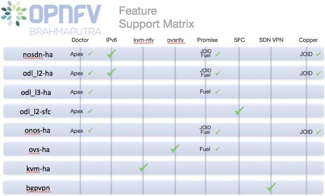

Each scenario provides a set of platform capabilities and features that it supports.  It is
possible to identify which features are provided by reviewing the scenario name, however
not all features and capabilities are discernible from the name itself.

Brahmaputra feature support matrix
^^^^^^^^^^^^^^^^^^^^^^^^^^^^^^^^^^

The following table provides an overview of the available scenarios and supported features
in the Brahmaputra release of OPNFV.

Scenario Naming
^^^^^^^^^^^^^^^

In OPNFV, scenarios are identified by short scenario names.  These names follow a scheme that
identifies the key components and behaviours of the scenario, the rules for scenario naming are as follows:

  os-[controller]-[feature]-[mode]-[option]

For example: *os-nosdn-kvm-noha* provides an OpenStack based deployment using neutron including
the OPNFV enhanced KVM hypervisor.

The [feature] tag in the scenario name describes the main feature provided by the scenario.
This scenario may also provide support for advanced fault management features which is not apparent
in the scenario name.  The following section describes the features available in each scenario.

