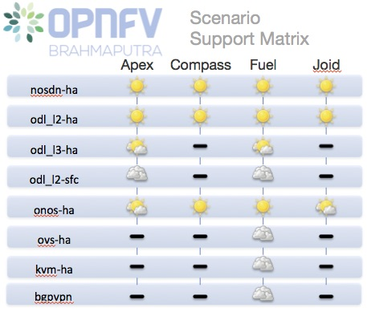

Scenarios are implemented as deployable compositions through integration with an installation tool.
OPNFV supports multiple installation tools and for any given release not all tools will support all
scenarios.  While our target is to establish parity across the installation tools to ensure they
can provide all scenarios, the practical challenge of achieving that goal for any given feature and
release results in some disparity.

Brahmaputra scenario overeview
^^^^^^^^^^^^^^^^^^^^^^^^^^^^^^

The following table provides an overview of the installation tools and available scenario's
in the Brahmaputra release of OPNFV.

Scenario status is indicated by a weather pattern icon.  All scenario's listed with
a weather pattern are possible to deploy and run in your enironment or a Pharos lab,
however they may have known limitations or issues as indicated by the icon.

Weather pattern icon legend:

+---------------------------------------------+----------------------------------+
| Weather Icon                                | Scenario Status                  |
+=============================================+==================================+
| .. image:: ../images/weather-clear.jpg      |	Stable, no known issues          |
+---------------------------------------------+----------------------------------+
| .. image:: ../images/weather-few-clouds.jpg | Stable, documented limitations   |
+---------------------------------------------+----------------------------------+
| .. image:: ../images/weather-overcast.jpg   | Stable, feature limitations      |
+---------------------------------------------+----------------------------------+
| .. image:: ../images/weather-dash.jpg       | Not deployed with this installer |
+---------------------------------------------+----------------------------------+

Scenario Naming
^^^^^^^^^^^^^^^

In OPNFV scenarios are identified by short scenario names, these names follow a scheme that
identifies the key components and behaviours of the scenario.  The rules for scenario naming are as follows:

  os-[controller]-[feature]-[mode]-[option]

Details of the fields are
  * os: mandatory

    * Refers to the platform type used
    * possible value: os (OpenStack)

* [controller]: mandatory

    * Refers to the SDN controller integrated in the platform
    * example values: nosdn, ocl, odl, onos

  * [feature]: mandatory

    * Refers to the feature projects supported by the scenario
    * example values: nofeature, kvm, ovs

  * [mode]: mandatory

    * Refers to the deployment type, which may include for instance high availability
    * possible values: ha, noha

  * [option]: optional

    * Used for the scenarios those do not fit into naming scheme.
    * The optional field in the short scenario name should not be included if there is no optional scenario.

Some examples of supported scenario names are:

  * os-nosdn-kvm-noha

    * This is an OpenStack based deployment using neutron including the OPNFV enhanced KVM hypervisor

  * os-odl_l2-nofeature-ha

    * This is an OpenStack deployment in high availability mode including OpenDaylight layer2 networking

  * os-onos-kvm_ovs-noha

    * This is an OpenStack deployment using ONOS including OPNFV enhanced KVM and OVS versions

Installing your scenario
^^^^^^^^^^^^^^^^^^^^^^^^

There are two main methods of deploying your target scenario, one method is to follow this guide which will
walk you through the process of deploying to your hardware using scripts or ISO images, the other method is
to set up a Jenkins slave and connect your infrastructure to the OPNFV Jenkins master.

For the purposes of evaluation and development a number of Brahmaputra scenarios are able to be deployed
virtually to mitigate the requirements on physical infrastructure.  Details and instructions on performing
virtual deployments can be found in the installer specific installation instructions.

To set up a Jenkins slave for automated deployment to your lab, refer to the `Jenkins slave connect guide.
<http://artifacts.opnfv.org/brahmaputra.1.0/docs/opnfv-jenkins-slave-connection.brahmaputra.1.0.html>`_

