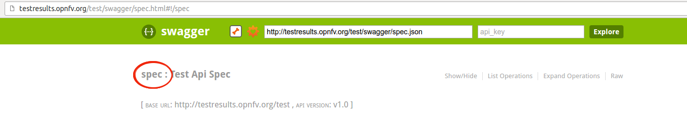
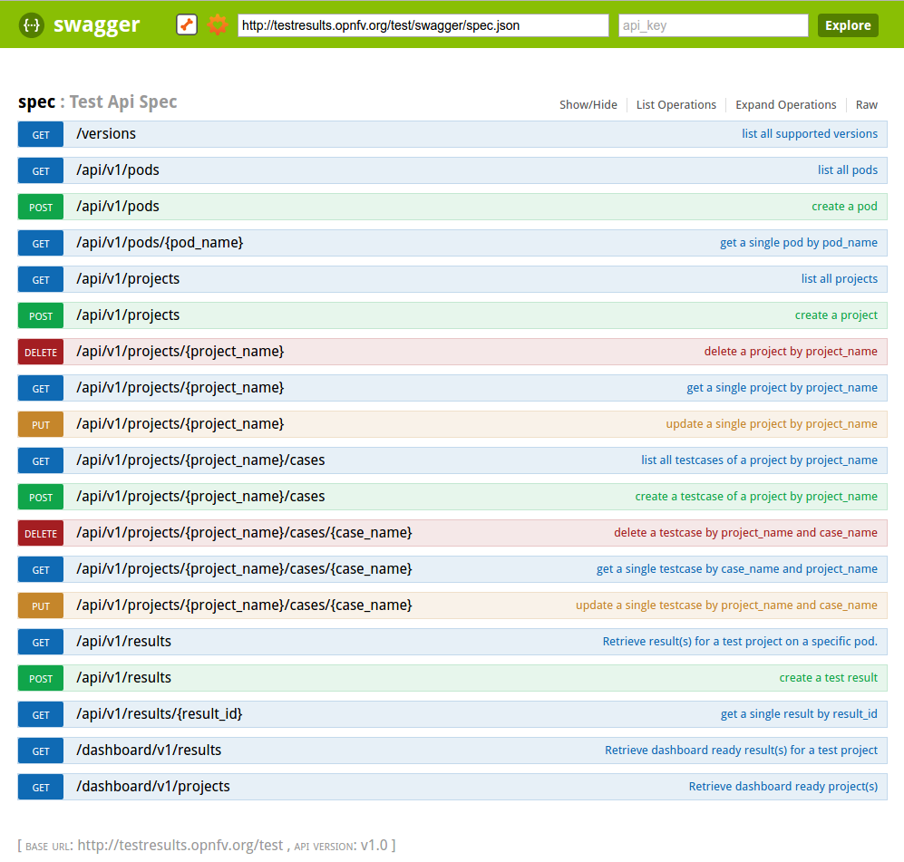

.. This work is licensed under a Creative Commons Attribution 4.0 International License.
.. SPDX-License-Identifier: CC-BY-4.0

***********************
Testing developer guide
***********************

.. toctree::
   :numbered:
   :maxdepth: 2

============
Introduction
============

The OPNFV testing ecosystem is wide.

The goal of this guide consists in providing some guidelines for new developers
involved in test areas.

For the description of the ecosystem, see `[DEV1]`_.

=================
Developer journey
=================

There are several ways to join test projects as a developer. In fact you may:

 * Develop new test cases
 * Develop frameworks
 * Develop tooling (reporting, dashboards, graphs, middleware,...)
 * Troubleshoot results
 * Post-process results

These different tasks may be done within a specific project or as a shared
resource accross the different projects.

If you develop new test cases, the best practice is to contribute upstream as
much as possible. You may contact the testing group to know which project - in
OPNFV or upstream - would be the best place to host the test cases. Such
contributions are usually directly connected to a specific project, more details
can be found in the user guides of the testing projects.

Each OPNFV testing project provides test cases and the framework to manage them.
As a developer, you can obviously contribute to them. The developer guide of
the testing projects shall indicate the procedure to follow.

Tooling may be specific to a project or generic to all the projects. For
specific tooling, please report to the test project user guide. The tooling used
by several test projects will be detailed in this document.

The best event to meet the testing community is probably the plugfest. Such an
event is organized after each release. Most of the test projects are present.

The summit is also a good opportunity to meet most of the actors `[DEV4]`_.

Be involved in the testing group
================================

The testing group is a self organized working group. The OPNFV projects dealing
with testing are invited to participate in order to elaborate and consolidate a
consistant test strategy (test case definition, scope of projects, resources for
long duration, documentation, ...) and align tooling or best practices.

A weekly meeting is organized, the agenda may be amended by any participant.
2 slots have been defined (US/Europe and APAC). Agendas and minutes are public.
See `[DEV3]`_ for details.
The testing group IRC channel is #opnfv-testperf

Best practices
==============

All the test projects do not have the same maturity and/or number of
contributors. The nature of the test projects may be also different. The
following best practices may not be acurate for all the projects and are only
indicative. Contact the testing group for further details.

Repository structure
--------------------

Most of the projects have a similar structure, which can be defined as follows::

  `-- home
    |-- requirements.txt
    |-- setup.py
    |-- tox.ini
    |
    |-- <project>
    |       |-- <api>
    |       |-- <framework>
    |       `-- <test cases>
    |
    |-- docker
    |     |-- Dockerfile
    |     `-- Dockerfile.aarch64.patch
    |-- <unit tests>
    `- docs
       |-- release
       |   |-- release-notes
       |   `-- results
       `-- testing
           |-- developer
           |     `-- devguide
           |-- user
                 `-- userguide

API
---
Test projects are installing tools and triggering tests. When it is possible it
is recommended to implement an API in order to perform the different actions.

Each test project should be able to expose and consume APIs from other test
projects. This pseudo micro service approach should allow a flexible use of
the different projects and reduce the risk of overlapping. In fact if project A
provides an API to deploy a traffic generator, it is better to reuse it rather
than implementing a new way to deploy it. This approach has not been implemented
yet but the prerequisites consiting in exposing and API has already been done by
several test projects.

CLI
---
Most of the test projects provide a docker as deliverable. Once connected, it is
possible to prepare the environement and run tests through a CLI.

Dockerization
-------------
Dockerization has been introduced in Brahmaputra and adopted by most of the test
projects. Docker containers are pulled on the jumphost of OPNFV POD.
<TODO Jose/Mark/Alec>

Code quality
------------

It is recommended to control the quality of the code of the testing projects,
and more precisely to implement some verifications before any merge:
  * pep8
  * pylint
  * unit tests (python 2.7)
  * unit tests (python 3.5)

The code of the test project must be covered by unit tests. The coverage
shall be reasonable and not decrease when adding new features to the framework.
The use of tox is recommended.
It is possible to implement strict rules (no decrease of pylint score, unit
test coverages) on critical python classes.

Third party tooling
-------------------

Several test projects integrate third party tooling for code quality check
and/or traffic generation. Some of the tools can be listed as follows:

+---------------+----------------------+------------------------------------+
| Project       | Tool                 | Comments                           |
+===============+======================+====================================+
| Bottlenecks   | TODO                 |                                    |
+---------------+----------------------+------------------------------------+
| Functest      | Tempest              | OpenStack test tooling             |
|               | Rally                | OpenStack test tooling             |
|               | Refstack             | OpenStack test tooling             |
|               | RobotFramework       | Used for ODL tests                 |
+---------------+----------------------+------------------------------------+
| QTIP          | Unixbench            |                                    |
|               | RAMSpeed             |                                    |
|               | nDPI                 |                                    |
|               | openSSL              |                                    |
|               | inxi                 |                                    |
+---------------+----------------------+------------------------------------+
| Storperf      | TODO                 |                                    |
+---------------+----------------------+------------------------------------+
| VSPERF        | TODO                 |                                    |
+---------------+----------------------+------------------------------------+
| Yardstick     | Moongen              | Traffic generator                  |
|               | Trex                 | Traffic generator                  |
|               | Pktgen               | Traffic generator                  |
|               | IxLoad, IxNet        | Traffic generator                  |
|               | SPEC                 | Compute                            |
|               | Unixbench            | Compute                            |
|               | RAMSpeed             | Compute                            |
|               | LMBench              | Compute                            |
|               | Iperf3               | Network                            |
|               | Netperf              | Network                            |
|               | Pktgen-DPDK          | Network                            |
|               | Testpmd              | Network                            |
|               | L2fwd                | Network                            |
|               | Fio                  | Storage                            |
|               | Bonnie++             | Storage                            |
+---------------+----------------------+------------------------------------+

======================================
Testing group configuration parameters
======================================

Testing categories
==================

The testing group defined several categories also known as tiers. These
categories can be used to group test suites.

+----------------+-------------------------------------------------------------+
| Category       | Description                                                 |
+================+=============================================================+
| Healthcheck    | Simple and quick healthcheck tests case                     |
+----------------+-------------------------------------------------------------+
| Smoke          | Set of smoke test cases/suites to validate the release      |
+----------------+-------------------------------------------------------------+
| Features       | Test cases that validate a specific feature on top of OPNFV.|
|                | Those come from Feature projects and need a bit of support  |
|                | for integration                                             |
+----------------+-------------------------------------------------------------+
| Components     | Tests on a specific component (e.g. OpenStack, OVS, DPDK,..)|
|                | It may extend smoke tests                                   |
+----------------+-------------------------------------------------------------+
| Performance    | Performance qualification                                   |
+----------------+-------------------------------------------------------------+
| VNF            | Test cases related to deploy an open source VNF including   |
|                | an orchestrator                                             |
+----------------+-------------------------------------------------------------+
| Stress         | Stress and robustness tests                                 |
+----------------+-------------------------------------------------------------+
| In Service     | In service testing                                          |
+----------------+-------------------------------------------------------------+

Testing domains
===============

The domains deal with the technical scope of the tests. It shall correspond to
domains defined for the certification program:

 * compute
 * network
 * storage
 * hypervisor
 * container
 * vim
 * mano
 * vnf
 * ...

Testing coverage
=================
One of the goals of the testing working group is to identify the poorly covered
areas and avoid testing overlap.
Ideally based on the declaration of the test cases, through the tags, domains
and tier fields, it shall be possible to create heuristic maps.

=============================================
Reliability, Stress and Long Duration Testing
=============================================

Resiliency of NFV refers to the ability of the NFV framework to limit disruption
and return to normal or at a minimum acceptable service delivery level in the
face of a fault, failure, or an event that disrupts the normal operation
`[DEV5]`_.

**Reliability** testing evaluates the ability of SUT to recover in face of fault,
failure or disrupts in normal operation or simply the ability of SUT absorbing
"disruptions".

Reliability tests use different forms of faults as stimulus, and the test must
measure the reaction in terms of the outage time or impairments to transmission.

**Stress testing** involves producing excess load as stimulus, and the test
must measure the reaction in terms of unexpected outages or (more likely)
impairments to transmission.

These kinds of "load" will cause "disruption" which could be easily found in
system logs. It is the purpose to raise such "load" to evaluate the SUT if it
could provide an acceptable level of service or level of confidence during such
circumstances. In Danube and Euphrates, we only considered the stress test with
excess load over OPNFV Platform.

In Danube, Bottlenecks and Yardstick project jointly implemented 2 stress tests
(concurrently create/destroy VM pairs and do ping, system throughput limit)
while Bottlenecks acts as the load manager calling yardstick to execute each
test iteration. These tests are designed to test for breaking points and provide
level of confidence of the system to users. Summary of the test cases are listed
in the following addresses:

  * https://wiki.opnfv.org/display/bottlenecks/Stress+Testing+over+OPNFV+Platform
  * https://wiki.opnfv.org/download/attachments/2926539/Testing%20over%20Long%20Duration%20POD.pptx?version=2&modificationDate=1502943821000&api=v2

**Stress test cases** for OPNFV Euphrates (OS Ocata) release can be seen as
extension/enhancement of those in D release. These tests are located in
Bottlenecks/Yardstick repo (Bottlenecks as load manager while Yardstick execute
each test iteration):

  * VNF scale out/up tests (also plan to measure storage usage simultaneously): https://wiki.opnfv.org/pages/viewpage.action?pageId=12390101
  * Life-cycle event with throughputs (measure NFVI to support concurrent
  network usage from different VM pairs):
  https://wiki.opnfv.org/display/DEV/Intern+Project%3A+Baseline+Stress+Test+Case+for+Bottlenecks+E+Release

In OPNFV E release, we also plan to do **long duration testing** over OS Ocata.
A separate CI pipe testing OPNFV XCI (OSA) is proposed to accomplish the job.
We have applied specific pod for the testing.
Proposals and details are listed below:
  * https://wiki.opnfv.org/display/testing/Euphrates+Testing+needs
  * https://wiki.opnfv.org/download/attachments/2926539/testing%20evolution%20v1_4.pptx?version=1&modificationDate=1503937629000&api=v2
  * https://wiki.opnfv.org/download/attachments/2926539/Testing%20over%20Long%20Duration%20POD.pptx?version=2&modificationDate=1502943821000&api=v2

The long duration testing is supposed to be started when OPNFV E release is
published.
A simple monitoring module for these tests is also planned to be added:
https://wiki.opnfv.org/display/DEV/Intern+Project%3A+Monitoring+Stress+Testing+for+Bottlenecks+E+Release

=======
How TOs
=======

Where can I find information on the different test projects?
===========================================================
On http://docs.opnfv.org! A section is dedicated to the testing projects. You
will find the overview of the ecosystem and the links to the project documents.

Another source is the testing wiki on https://wiki.opnfv.org/display/testing

You may also contact the testing group on the IRC channel #opnfv-testperf or by
mail at test-wg AT lists.opnfv.org (testing group) or opnfv-tech-discuss AT
lists.opnfv.org (generic technical discussions).

How can I contribute to a test project?
=======================================
As any project, the best solution is to contact the project. The project
members with their email address can be found under
https://git.opnfv.org/<project>/tree/INFO

You may also send a mail to the testing mailing list or use the IRC channel
#opnfv-testperf

Where can I find hardware resources?
====================================
You should discuss this topic with the project you are working with. If you need
access to an OPNFV community POD, it is possible to contact the infrastructure
group. Depending on your needs (scenario/installer/tooling), it should be
possible to find free time slots on one OPNFV community POD from the Pharos
federation. Create a JIRA ticket to describe your needs on
https://jira.opnfv.org/projects/INFRA.
You must already be an OPNFV contributor. See
https://wiki.opnfv.org/display/DEV/Developer+Getting+Started.

Please note that lots of projects have their own "how to contribute" or
"get started" page on the OPNFV wiki.

How do I integrate my tests in CI?
==================================
It shall be discussed directly with the project you are working with. It is
done through jenkins jobs calling testing project files but the way to onboard
cases differ from one project to another.

How to declare my tests in the test Database?
=============================================
If you have access to the test API swagger (access granted to contributors), you
may use the swagger interface of the test API to declare your project.
The URL is http://testresults.opnfv.org/test/swagger/spec.html.

Click on *Spec*, the list of available methods must be displayed.

For the declaration of a new project use the POST /api/v1/projects method.
For the declaration of new test cases in an existing project, use the POST
 /api/v1/projects/{project_name}/cases method

 .. figure:: ../../../images/CreateCase.png
    :align: center
    :alt: Testing group declare new test case

How to push your results into the Test Database?
================================================

The test database is used to collect test results. By default it is
enabled only for CI tests from Production CI pods.

Please note that it is possible to create your own local database.

A dedicated database is for instance created for each plugfest.

The architecture and associated API is described in previous chapter.
If you want to push your results from CI, you just have to call the API
at the end of your script.

You can also reuse a python function defined in functest_utils.py `[DEV2]`_

Where can I find the documentation on the test API?
===================================================

The Test API is now documented in this document (see sections above).
You may also find autogenerated documentation in
http://artifacts.opnfv.org/releng/docs/testapi.html
A web protal is also under construction for certification at
http://testresults.opnfv.org/test/#/

I have tests, to which category should I declare them?
======================================================
See table above.

The main ambiguity could be between features and VNF.
In fact sometimes you have to spawn VMs to demonstrate the capabilities of the
feature you introduced.
We recommend to declare your test in the feature category.

VNF category is really dedicated to test including:

 * creation of resources
 * deployement of an orchestrator/VNFM
 * deployment of the VNF
 * test of the VNFM
 * free resources

The goal is not to study a particular feature on the infrastructure but to have
a whole end to end test of a VNF automatically deployed in CI.
Moreover VNF are run in weekly jobs (one a week), feature tests are in daily
jobs and use to get a scenario score.

Where are the logs of CI runs?
==============================

Logs and configuration files can be pushed to artifact server from the CI under
http://artifacts.opnfv.org/<project name>

==========
References
==========

`[DEV1]`_: OPNFV Testing Ecosystem

`[DEV2]`_: Python code sample to push results into the Database

`[DEV3]`_: Testing group wiki page

`[DEV4]`_: Conversation with the testing community, OPNFV Beijing Summit

`[DEV5]`_: GS NFV 003

.. _`[DEV1]`: http://docs.opnfv.org/en/latest/testing/ecosystem/index.html
.. _`[DEV2]`: https://git.opnfv.org/functest/tree/functest/utils/functest_utils.py#176
.. _`[DEV3]`: https://wiki.opnfv.org/display/meetings/Test+Working+Group+Weekly+Meeting
.. _`[DEV4]`: https://www.youtube.com/watch?v=f9VAUdEqHoA
.. _`[DEV5]`: http://www.etsi.org/deliver/etsi_gs/NFV/001_099/003/01.01.01_60/gs_NFV003v010101p.pdf

IRC support chan: #opnfv-testperf
