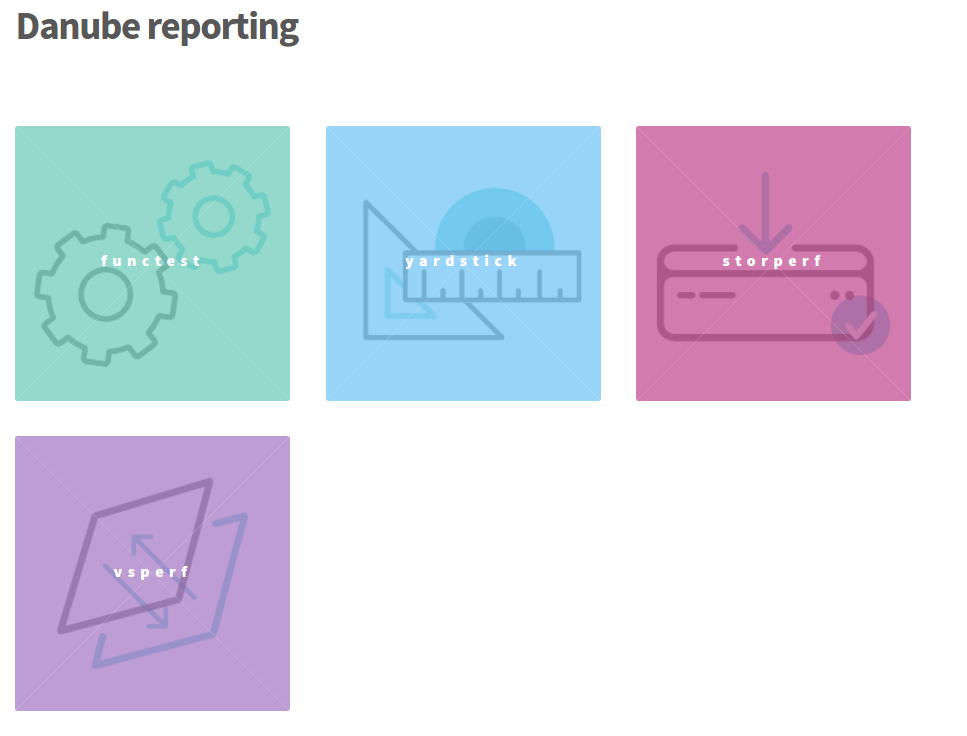

.. This work is licensed under a Creative Commons Attribution 4.0 International License.
.. SPDX-License-Identifier: CC-BY-4.0

=============
OPNFV testing
=============

Introduction
============

Testing is one of the key activities in OPNFV and includes unit, feature, component, system
level testing for development, automated deployment, performance characterization or stress
testing.

Test projects are dedicated to provide frameworks, tooling and test-cases categorized as
functional, performance or compliance testing. Test projects fulfill different roles such as
verifying VIM functionality, benchmarking components and platforms or analysis of measured
KPIs for the scenarios released in OPNFV.

Feature projects also provide their own test suites that either run independently or within a
test project.

This document details the OPNFV testing ecosystem, describes common test components used
by individual OPNFV projects and provides links to project specific documentation.

OPNFV testing ecosystem
=======================

The testing projects
--------------------

The OPNFV testing projects may be summarized as follows:

.. figure:: ../../images/OPNFV_testing_working_group.png
   :align: center
   :alt: Overview of OPNFV Testing projects

The major testing projects are described in the table below:

+----------------+---------------------------------------------------------+
|  Project       |   Description                                           |
+================+=========================================================+
|  Bottlenecks   | This project aims to find system bottlenecks by testing |
|                | and verifying OPNFV infrastructure in a staging         |
|                | environment before committing it to a production        |
|                | environment. Instead of debugging a deployment in       |
|                | production environment, an automatic method for         |
|                | executing benchmarks which plans to validate the        |
|                | deployment during staging is adopted. This project      |
|                | forms a staging framework to find bottlenecks and to do |
|                | analysis of the OPNFV infrastructure.                   |
+----------------+---------------------------------------------------------+
| CPerf          | SDN Controller benchmarks and performance testing,      |
|                | applicable to controllers in general. Collaboration of  |
|                | upstream controller testing experts, external test tool |
|                | developers and the standards community. Primarily       |
|                | contribute to upstream/external tooling, then add jobs  |
|                | to run those tools on OPNFV's infrastructure.           |
+----------------+---------------------------------------------------------+
| Dovetail       | This project intends to define and provide a set of     |
|                | OPNFV related validation criteria that will provide     |
|                | input for the evaluation of the use of OPNFV trademarks.|
|                | The dovetail project is executed with the guidance and  |
|                | oversight of the Compliance and Certification committee |
|                | and work to secure the goals of the C&C committee for   |
|                | each release. The project intends to incrementally      |
|                | define qualification criteria that establish the        |
|                | foundations of how we are able to measure the ability to|
|                | utilize the OPNFV platform, how the platform itself     |
|                | should behave, and how applications may be deployed on  |
|                | the platform.                                           |
+----------------+---------------------------------------------------------+
| Functest       | This project deals with the functional testing of the   |
|                | VIM and NFVI. It leverages several upstream test suites |
|                | (OpenStack, ODL, ONOS, etc.) and can be used by feature |
|                | project to launch feature test suites in CI/CD.         |
|                | The project is used for scenario validation.            |
+----------------+---------------------------------------------------------+
| Qtip           | QTIP as the project for "Platform Performance           |
|                | Benchmarking" in OPNFV aims to provide user a simple    |
|                | indicator for performance, supported by comprehensive   |
|                | testing data and transparent calculation formula.       |
|                | It provides a platform with common services for         |
|                | performance benchmarking which helps users to build     |
|                | indicators by themselves with ease.                     |
+----------------+---------------------------------------------------------+
| Storperf       | The purpose of this project is to provide a tool to     |
|                | measure block and object storage performance in an NFVI.|
|                | When complemented with a characterization of typical VF |
|                | storage performance requirements, it can provide        |
|                | pass/fail thresholds for test, staging, and production  |
|                | NFVI environments.                                      |
+----------------+---------------------------------------------------------+
| VSperf         | This project provides a framework for automation of NFV |
|                | data-plane performance testing and benchmarking. The    |
|                | NFVI fast-path includes switch technology and network   |
|                | with physical and virtual interfaces. VSperf can be     |
|                | used to evaluate the suitability of different Switch    |
|                | implementations and features, quantify data-path        |
|                | performance and optimize platform configurations.       |
+----------------+---------------------------------------------------------+
| Yardstick      | The goal of the Project is to verify the infrastructure |
|                | compliance when running VNF applications. NFV Use Cases |
|                | described in ETSI GS NFV 001 show a large variety of    |
|                | applications, each defining specific requirements and   |
|                | complex configuration on the underlying infrastructure  |
|                | and test tools.The Yardstick concept decomposes typical |
|                | VNF work-load performance metrics into a number of      |
|                | characteristics/performance vectors, which each of them |
|                | can be represented by distinct test-cases.              |
+----------------+---------------------------------------------------------+

===================================
The testing working group resources
===================================

The assets
==========

Overall Architecture
--------------------
The Test result management can be summarized as follows::

  +-------------+    +-------------+    +-------------+
  |             |    |             |    |             |
  |   Test      |    |   Test      |    |   Test      |
  | Project #1  |    | Project #2  |    | Project #N  |
  |             |    |             |    |             |
  +-------------+    +-------------+    +-------------+
           |               |               |
           V               V               V
       +---------------------------------------------+
       |                                             |
       |           Test Rest API front end           |
       |    http://testresults.opnfv.org/test        |
       |                                             |
       +---------------------------------------------+
           ^                |                     ^
           |                V                     |
           |     +-------------------------+      |
           |     |                         |      |
           |     |    Test Results DB      |      |
           |     |         Mongo DB        |      |
           |     |                         |      |
           |     +-------------------------+      |
           |                                      |
           |                                      |
     +----------------------+        +----------------------+
     |                      |        |                      |
     | Testing Dashboards   |        |      Landing page    |
     |                      |        |                      |
     +----------------------+        +----------------------+

The testing databases
---------------------
A Mongo DB Database has been introduced for the Brahmaputra release.
The following collections are declared in this database:
 * pods: the list of pods used for production CI
 * projects: the list of projects providing test cases
 * testcases: the test cases related to a given project
 * results: the results of the test cases
 * scenarios: the OPNFV scenarios tested in CI

This database can be used by any project through the testapi.
Please note that projects may also use additional databases. This database is
mainly use to colelct CI results and scenario trust indicators.

This database is also cloned for OPNFV Plugfest.

The test API
------------
The Test API is used to declare pods, projects, test cases and test results.
Pods correspond to the cluster of machines (3 controller and 2 compute nodes in
HA mode) used to run the tests and defined in Pharos project.
The results pushed in the database are related to pods, projects and cases.
If you try to push results of test done on non referenced pod, the API will
return an error message.

An additional method dashboard has been added to post-process the raw results in
the Brahmaputra release (deprecated in Colorado release).

The data model is very basic, 5 objects are available:
  * Pods
  * Projects
  * Testcases
  * Results
  * Scenarios

For detailed information, please go to http://artifacts.opnfv.org/releng/docs/testapi.html

The reporting
-------------
The reporting page for the test projects is http://testresults.opnfv.org/reporting/

.. figure:: ../../images/reporting_page.png
   :align: center
   :alt: Testing group reporting page

This page provides a reporting per OPNFV release and per testing project.

An evolution of this page is planned.
It was decided to unify the reporting by creating a landing page that should give
the scenario status in one glance (it was previously consolidated manually
on a wiki page).

The landing page (planned for Danube 2.0) will be displayed per scenario:
 * the status of the deployment
 * the score of the test projectS
 * a trust indicator

Additional filters (version, installer, test collection time window,... ) are
included.

The test case catalog
---------------------
Until the Colorado release, each testing project was managing the list of its
test cases. It was very hard to have a global view of the available test cases
among the different test projects. A common view was possible through the API
but it was not very user friendly.
In fact you may know all the cases per project calling:

 http://testresults.opnfv.org/test/api/v1/projects/<project_name>/cases

with project_name: bottlenecks, functest, qtip, storperf, vsperf, yardstick

It was decided to build a web site providing a consistent view of the test cases
per project and allow any scenario owner to build his/her custom list of tests
(Danube 2.0).

Other resources
===============

wiki: https://wiki.opnfv.org/testing

mailing list: test-wg@lists.opnfv.org

IRC chan: #opnfv-testperf

weekly meeting (https://wiki.opnfv.org/display/meetings/TestPerf):
 * Usual time: Every Thursday 15:00-16:00 UTC / 7:00-8:00 PST
 * APAC time: 2nd Wednesday of the month 8:00-9:00 UTC

=======================
Reference documentation
=======================

+----------------+---------------------------------------------------------+
|  Project       |   Documentation links                                   |
+================+=========================================================+
|  Bottlenecks   | https://wiki.opnfv.org/display/bottlenecks/Bottlenecks  |
+----------------+---------------------------------------------------------+
| CPerf          | https://wiki.opnfv.org/display/cperf                    |
+----------------+---------------------------------------------------------+
| Dovetail       | https://wiki.opnfv.org/display/dovetail                 |
+----------------+---------------------------------------------------------+
| Functest       | https://wiki.opnfv.org/display/functest/                |
+----------------+---------------------------------------------------------+
| Qtip           | https://wiki.opnfv.org/display/qtip                     |
+----------------+---------------------------------------------------------+
| Storperf       | https://wiki.opnfv.org/display/storperf/Storperf        |
+----------------+---------------------------------------------------------+
| VSperf         | https://wiki.opnfv.org/display/vsperf                   |
+----------------+---------------------------------------------------------+
| Yardstick      | https://wiki.opnfv.org/display/yardstick/Yardstick      |
+----------------+---------------------------------------------------------+
