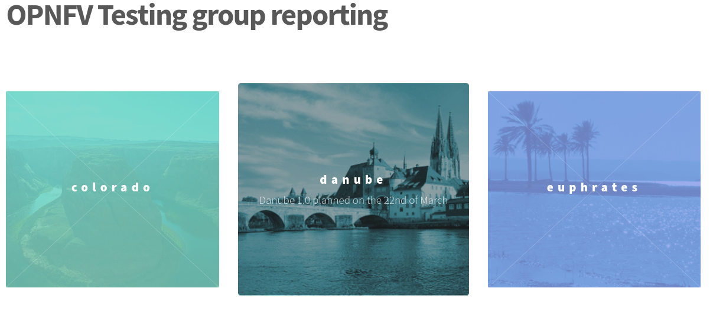
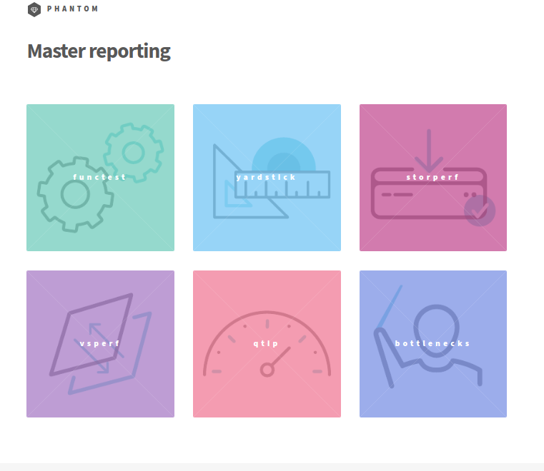
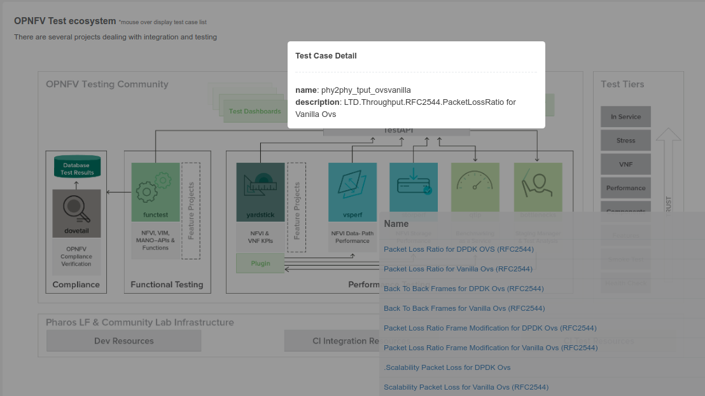

.. This work is licensed under a Creative Commons Attribution 4.0 International License.
.. SPDX-License-Identifier: CC-BY-4.0

======================
OPNFV Testing Overview
======================

Introduction
============

Testing is one of the key activities in OPNFV and includes unit, feature,
component, system level testing for development, automated deployment,
performance characterization and stress testing.

Test projects are dedicated to provide frameworks, tooling and test-cases categorized as
functional, performance or compliance testing. Test projects fulfill different roles such as
verifying VIM functionality, benchmarking components and platforms or analysis of measured
KPIs for OPNFV release scenarios.

Feature projects also provide their own test suites that either run independently or within a
test project.

This document details the OPNFV testing ecosystem, describes common test components used
by individual OPNFV projects and provides links to project specific documentation.

The OPNFV Testing Ecosystem
===========================

The OPNFV testing projects are represented in the following diagram:

.. figure:: ../../images/OPNFV_testing_working_group.png
   :align: center
   :alt: Overview of OPNFV Testing projects

The major testing projects are described in the table below:

+----------------+---------------------------------------------------------+
|  Project       |   Description                                           |
+================+=========================================================+
|  Bottlenecks   | This project aims to find system bottlenecks by testing |
|                | and verifying OPNFV infrastructure in a staging         |
|                | environment before committing it to a production        |
|                | environment. Instead of debugging a deployment in       |
|                | production environment, an automatic method for         |
|                | executing benchmarks which plans to validate the        |
|                | deployment during staging is adopted. This project      |
|                | forms a staging framework to find bottlenecks and to do |
|                | analysis of the OPNFV infrastructure.                   |
+----------------+---------------------------------------------------------+
| CPerf          | SDN Controller benchmarks and performance testing,      |
|                | applicable to controllers in general. Collaboration of  |
|                | upstream controller testing experts, external test tool |
|                | developers and the standards community. Primarily       |
|                | contribute to upstream/external tooling, then add jobs  |
|                | to run those tools on OPNFV's infrastructure.           |
+----------------+---------------------------------------------------------+
| Dovetail       | This project intends to define and provide a set of     |
|                | OPNFV related validation criteria/tests that will       |
|                | provide input for the OPNFV Complaince Verification     |
|		 | Program.  The Dovetail project is executed with the     |
|                | guidance and oversight of the Complaince and            |
|                | Certification (C&C) committee and work to secure the    |
|                | goals of the C&C committee for each release. The        |
|                | project intends to incrementally define qualification   |
|                | criteria that establish the foundations of how one is   |
|                | able to measure the ability to utilize the OPNFV        |
|                | platform, how the platform itself should behave, and    |
|                | how applications may be deployed on the platform.       |
+----------------+---------------------------------------------------------+
| Functest       | This project deals with the functional testing of the   |
|                | VIM and NFVI. It leverages several upstream test suites |
|                | (OpenStack, ODL, ONOS, etc.) and can be used by feature |
|                | project to launch feature test suites in CI/CD.         |
|                | The project is used for scenario validation.            |
+----------------+---------------------------------------------------------+
| NFVbench       | NFVbench is a compact and self contained data plane     |
|                | performance measurement tool for OpensStack based NFVi  |
|                | platforms. It is agnostic of the NFVi distribution,     |
|                | Neutron networking implementation and hardware.         |
|                | It runs on any Linux server with a DPDK compliant       |
|                | NIC connected to the NFVi platform data plane and       |
|                | bundles a highly efficient software traffic generator.  |
|                | Provides a fully automated measurement of most common   |
|                | packet paths at any level of scale and load using       |
|                | RFC-2544. Available as a Docker container with simple   |
|                | command line and REST interfaces.                       |
|                | Easy to use as it takes care of most of the guesswork   |
                 | generally associated to data plane benchmarking.        |
|                | Can run in any lab or in production environments.       |
+----------------+---------------------------------------------------------+
| Qtip           | QTIP as the project for "Platform Performance           |
|                | Benchmarking" in OPNFV aims to provide user a simple    |
|                | indicator for performance, supported by comprehensive   |
|                | testing data and transparent calculation formula.       |
|                | It provides a platform with common services for         |
|                | performance benchmarking which helps users to build     |
|                | indicators by themselves with ease.                     |
+----------------+---------------------------------------------------------+
| Storperf       | The purpose of this project is to provide a tool to     |
|                | measure block and object storage performance in an NFVI.|
|                | When complemented with a characterization of typical VF |
|                | storage performance requirements, it can provide        |
|                | pass/fail thresholds for test, staging, and production  |
|                | NFVI environments.                                      |
+----------------+---------------------------------------------------------+
| VSPERF         | VSPERF is an OPNFV project that provides an automated   |
|                | test-framework and comprehensive test suite based on    |
|                | Industry Test Specifications for measuring NFVI         |
|                | data-plane performance. The data-path includes switching|
|                | technologies with physical and virtual network          |
|                | interfaces. The VSPERF architecture is switch and       |
|                | traffic generator agnostic and test cases can be easily |
|                | customized. Software versions and configurations        |
|                | including the vSwitch (OVS or VPP) as well as the       |
|                | network topology are controlled by VSPERF (independent  |
|                | of OpenStack). VSPERF is used as a development tool for |
|                | optimizing switching technologies, qualification of     |
|                | packet processing components and for pre-deployment     |
|                | evaluation of the NFV platform data-path.               |
+----------------+---------------------------------------------------------+
| Yardstick      | The goal of the Project is to verify the infrastructure |
|                | compliance when running VNF applications. NFV Use Cases |
|                | described in ETSI GS NFV 001 show a large variety of    |
|                | applications, each defining specific requirements and   |
|                | complex configuration on the underlying infrastructure  |
|                | and test tools.The Yardstick concept decomposes typical |
|                | VNF work-load performance metrics into a number of      |
|                | characteristics/performance vectors, which each of them |
|                | can be represented by distinct test-cases.              |
+----------------+---------------------------------------------------------+

===============================
Testing Working Group Resources
===============================

Test Results Collection Framework
=================================

Any test project running in the global OPNFV lab infrastructure and is
integrated with OPNFV CI can push test results to the community Test Database
using a common Test API. This database can be used to track the evolution of
testing and analyse test runs to compare results across installers, scenarios
and between technically and geographically diverse hardware environments.

Results from the databse are used to generate a dashboard with the current test
status for each testing project. Please note that you can also deploy the Test
Database and Test API locally in your own environment.

Overall Test Architecture
-------------------------

The management of test results can be summarized as follows::

  +-------------+    +-------------+    +-------------+
  |             |    |             |    |             |
  |   Test      |    |   Test      |    |   Test      |
  | Project #1  |    | Project #2  |    | Project #N  |
  |             |    |             |    |             |
  +-------------+    +-------------+    +-------------+
           |               |               |
           V               V               V
       +---------------------------------------------+
       |                                             |
       |           Test Rest API front end           |
       |    http://testresults.opnfv.org/test        |
       |                                             |
       +---------------------------------------------+
           ^                |                     ^
           |                V                     |
           |     +-------------------------+      |
           |     |                         |      |
           |     |    Test Results DB      |      |
           |     |         Mongo DB        |      |
           |     |                         |      |
           |     +-------------------------+      |
           |                                      |
           |                                      |
     +----------------------+        +----------------------+
     |                      |        |                      |
     | Testing Dashboards   |        |  Test Landing page   |
     |                      |        |                      |
     +----------------------+        +----------------------+

The Test Database
-----------------
A Mongo DB Database was introduced for the Brahmaputra release.
The following collections are declared in this database:
 * pods: the list of pods used for production CI
 * projects: the list of projects providing test cases
 * test cases: the test cases related to a given project
 * results: the results of the test cases
 * scenarios: the OPNFV scenarios tested in CI

This database can be used by any project through the Test API.
Please note that projects may also use additional databases. The Test
Database is mainly use to collect CI test results and generate scenario
trust indicators. The Test Database is also cloned for OPNFV Plugfests in
order to provide a private datastore only accessible to Plugfest participants.

Test API description
--------------------
The Test API is used to declare pods, projects, test cases and test results.
Pods correspond to a cluster of machines (3 controller and 2 compute nodes in
HA mode) used to run the tests and are defined in the Pharos project.
The results pushed in the database are related to pods, projects and test cases.
Trying to push results generated from a non-referenced pod will return an error
message by the Test API.

The data model is very basic, 5 objects are available:
  * Pods
  * Projects
  * Test cases
  * Results
  * Scenarios

For detailed information, please go to http://artifacts.opnfv.org/releng/docs/testapi.html

The code of the Test API is hosted in the releng repository `[TST2]`_.
The static documentation of the Test API can be found at `[TST3]`_.
The Test API has been dockerized and may be installed locally in your lab.

The deployment of the Test API has been automated.
A jenkins job manages:

  * the unit tests of the Test API
  * the creation of a new docker file
  * the deployment of the new Test API
  * the archive of the old Test API
  * the backup of the Mongo DB

Test API Authorization
----------------------

PUT/DELETE/POST operations of the TestAPI now require token based authorization. The token needs
to be added in the request using a header 'X-Auth-Token' for access to the database.

e.g::
    headers['X-Auth-Token']

The value of the header i.e the token can be accessed in the jenkins environment variable
*TestApiToken*. The token value is added as a masked password.

.. code-block:: python

    headers['X-Auth-Token'] = os.environ.get('TestApiToken')

The above example is in Python. Token based authentication has been added so
that only CI pods running Jenkins jobs can access the database. Please note
that currently token authorization is implemented but is not yet enabled.

Test Project Reporting
======================
The reporting page for the test projects is http://testresults.opnfv.org/reporting/

This page provides reporting per OPNFV release and per testing project.

An evolution of the reporting page is planned to unify test reporting by creating
a landing page that shows the scenario status in one glance (this information was
previously consolidated manually on a wiki page). The landing page will be displayed
per scenario and show:

 * the status of the deployment
 * the score from each test suite. There is no overall score, it is determined
 by each test project.
 * a trust indicator

Test Case Catalog
=================
Until the Colorado release, each testing project managed the list of its
test cases. This made it very hard to have a global view of the available test
cases from the different test projects. A common view was possible through the API
but it was not very user friendly.
Test cases per project may be listed by calling:

 http://testresults.opnfv.org/test/api/v1/projects/<project_name>/cases

with project_name: bottlenecks, functest, qtip, storperf, vsperf, yardstick

A test case catalog has now been realized `[TST4]`_. Roll over the project then
click to get the list of test cases, and then click on the case to get more details.

Test Dashboards
===============

The Test Dashboard is used to provide a consistent view of the results collected in CI.
The results shown on the dashboard are post processed from the Database, which only
contains raw results.
The dashboard can be used in addition to the reporting page (high level view) to allow
the creation of specific graphs according to what the test owner wants to show.

In Brahmaputra, a basic dashboard was created in Functest.
In Colorado, Yardstick used Grafana (time based graphs) and ELK (complex
graphs).
Since Danube, the OPNFV testing community decided to adopt the ELK framework and to
use Bitergia for creating highly flexible dashboards `[TST5]`_.

.. figure:: ../../images/DashboardBitergia.png
   :align: center
   :alt: Testing group testcase catalog

OPNFV Test Group Information
============================

For more information or to participate in the OPNFV test community please see the
following:

wiki: https://wiki.opnfv.org/testing

mailing list: test-wg@lists.opnfv.org

IRC channel: #opnfv-testperf

weekly meeting (https://wiki.opnfv.org/display/meetings/TestPerf):
 * Usual time: Every Thursday 15:00-16:00 UTC / 7:00-8:00 PST
 * APAC time: 2nd Wednesday of the month 8:00-9:00 UTC

=======================
Reference Documentation
=======================

+----------------+---------------------------------------------------------+
|  Project       |   Documentation links                                   |
+================+=========================================================+
|  Bottlenecks   | https://wiki.opnfv.org/display/bottlenecks/Bottlenecks  |
+----------------+---------------------------------------------------------+
| CPerf          | https://wiki.opnfv.org/display/cperf                    |
+----------------+---------------------------------------------------------+
| Dovetail       | https://wiki.opnfv.org/display/dovetail                 |
+----------------+---------------------------------------------------------+
| Functest       | https://wiki.opnfv.org/display/functest/                |
+----------------+---------------------------------------------------------+
| NFVbench       | https://wiki.opnfv.org/display/nfvbench/                |
+----------------+---------------------------------------------------------+
| Qtip           | https://wiki.opnfv.org/display/qtip                     |
+----------------+---------------------------------------------------------+
| Storperf       | https://wiki.opnfv.org/display/storperf/Storperf        |
+----------------+---------------------------------------------------------+
| VSperf         | https://wiki.opnfv.org/display/vsperf                   |
+----------------+---------------------------------------------------------+
| Yardstick      | https://wiki.opnfv.org/display/yardstick/Yardstick      |
+----------------+---------------------------------------------------------+

`[TST1]`_: OPNFV web site

`[TST2]`_: Test utils in Releng

`[TST3]`_: TestAPI autogenerated documentation

`[TST4]`_: Testcase catalog

`[TST5]`_: Testing group dashboard

.. _`[TST1]`: http://www.opnfv.org
.. _`[TST2]`: https://git.opnfv.org/functest/tree/releng/utils/tests
.. _`[TST3]`: http://artifacts.opnfv.org/releng/docs/testapi.html
.. _`[TST4]`: http://testresults.opnfv.org/testing/index.html#!/select/visual
.. _`[TST5]`: https://opnfv.biterg.io:443/goto/283dba93ca18e95964f852c63af1d1ba
